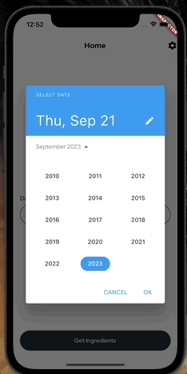
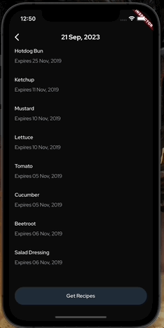

# yesufu-bashir-techtask-mobile

# Fridge 
Get ingredients from storage and recommend meal recipes using selected recipes.


## Screenshots of the app

<p float="left">
  
  
</p>

## Getting Started
This repository contain the code for the Fridge App. This project was written using the Flutter 3.13.4 SDK and Dart programming Language. If you're new to Flutter and Dart, Check out the SDK at https://www.flutter.dev and the language at https://dart.dev/.

## How to Use

**Step 1:**

You must have Flutter and Dart Installed to build this project. Check the links above if you haven't done so. You might experience build issues running on a lower flutter version. If you don't have flutter ^3.0.0, You can use fvm to download it and manage your flutter version locally. I have included a link to it.

```
https://fvm.app/
```

Download or clone this repo by using the link below:

```
https://github.com/BashirYesufu/yesufu-bashir-techtask-mobile.git
```

**Step 2:**

Go to project root and execute the following command in terminal to get the required dependencies:

```
flutter pub get 
```

**Step 3:**

Run your simulator for iOS or android emulator and smash the build button. Easy!
I have added a request inspector to enable you see api calls while running the app. This can be disabled in the main.dart file

### Libraries & Tools Used

* [Dio] - Networking
* [Flutter_Riverpod] - State Management
* [Shared Preferences] - Local Data Persistence
* [Lottie] - Custom Loading State Widget
* [Country Picker] - For displaying bottom sheet of countries


### Notice
If you use a mac with Apple Silicon chips, you might run into build issues on ios. To fix this, run the commands below in your terminal

```
cd ios
pod cache clean --all
Pod clean
pod deintegrate
sudo gem install cocoapods-deintegrate cocoapods-clean

sudo arch -x86_64 gem install ffi
arch -x86_64 pod repo update
arch -x86_64 pod install
```

## Conclusion
May The Code be with you.
